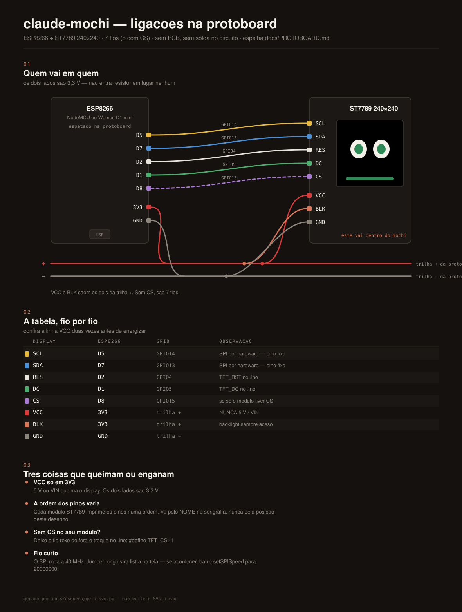

# Montagem na protoboard

Guia para o primeiro teste, sem case e sem solda no circuito. A ideia é validar
o hardware **antes** de mexer em qualquer configuração do PC.

A ordem importa: cada passo só depende do anterior, então quando algo falhar
você sabe exatamente onde.

---

## 1. O que ter na mão

- ESP8266 (NodeMCU / Wemos D1 mini)
- Display ST7789 240×240 SPI, **com a barra de pinos já soldada**
- Jumpers fêmea-fêmea (ou macho-fêmea, se for usar a protoboard)
- Protoboard
- Cabo USB **com fios de dados**

Nada de resistor: os dois lados são 3,3 V.

> **Sobre a protoboard e a largura da placa.** Um NodeMCU v3 tem 31 mm e ocupa
> quase toda a protoboard padrão, sobrando **uma coluna livre de cada lado** —
> dá pra trabalhar, mas é apertado. O Wemos D1 mini (26 mm) deixa duas.
>
> Se ficar espremido, o caminho **ainda mais simples** é dispensar a protoboard
> nesta fase: jumpers fêmea-fêmea ligando direto os pinos do ESP nos pinos do
> display. São 7 ligações, e para um teste isso basta.

---

## 2. Ligações

<p align="center">
  
</p>

**Confira duas vezes a linha VCC antes de energizar.** 5 V queima o display.

| Display | ESP8266 | Observação |
|---|---|---|
| GND | GND | |
| VCC | **3V3** | nunca 5 V / VIN |
| SCL (ou SCK) | D5 | GPIO14 — fixo, SPI por hardware |
| SDA (ou MOSI) | D7 | GPIO13 — fixo, SPI por hardware |
| RES (ou RST) | D2 | GPIO4 |
| DC | D1 | GPIO5 |
| BLK | **3V3** | backlight sempre aceso — o mais simples |
| CS | D8 | **só se o seu módulo tiver esse pino** |

São **7 ligações** (módulo de 7 pinos) ou **8** (módulo com CS).

Na protoboard, leve um jumper do `3V3` do ESP para a trilha **+** e um do `GND`
para a trilha **−**; daí saem os fios curtos de `VCC` e `BLK`.

Se o seu módulo **não tem CS**, abra o `.ino` e troque:

```c
#define TFT_CS   -1
```

Mantenha os jumpers curtos. Fio longo em SPI a 40 MHz gera ruído na imagem.

---

## 3. Passo 1 — só energia

Ligue o USB **sem gravar nada ainda**.

Esperado: a placa acende o LED e o **backlight do display acende** (tela branca
ou cinza uniforme, sem imagem — isso é normal, ainda não há firmware).

Se nada acender, ou se algo esquentar, tire da tomada e confira VCC/GND antes de
seguir.

---

## 4. Passo 2 — gravar e ver a animação

1. Arduino IDE → **Preferences → Additional Boards Manager URLs**:
   `https://arduino.esp8266.com/stable/package_esp8266com_index.json`
2. **Boards Manager** → *esp8266 by ESP8266 Community*
3. **Library Manager** → *Adafruit GFX Library* e *Adafruit ST7735 and ST7789 Library*
4. Abra `firmware/claude_mochi/claude_mochi.ino`, escolha a placa e a porta, grave.

**Esperado:** ao terminar a gravação, os olhos varrem de arregalados a
semicerrados e voltam, com a cor indo de verde a vermelho e a barra de baixo
enchendo — uns 3 segundos. Depois os olhos "cochilam" (traço fino), esperando o
PC.

**Se essa animação rodou, seu hardware está pronto.** Nada aqui depende de rede,
de status line ou de ponte serial.

---

## 5. Passo 3 — testar o protocolo pelo Monitor Serial

Ainda sem nenhuma configuração no Claude Code.

Abra o **Monitor Serial** da Arduino IDE e ajuste duas coisas:

- velocidade **115200**
- terminação de linha: **Nova linha (NL)**

> ⚠️ **É aqui que quase todo mundo trava.** O firmware só processa a linha
> quando recebe o `\n`. Se o Monitor Serial estiver em "Sem final de linha"
> (padrão em algumas versões), você digita, aperta enter e **não acontece
> absolutamente nada** — sem erro, sem pista.

Abrir o Monitor Serial reinicia a placa, então você verá a animação de boot de
novo. Normal.

Digite e envie:

```
ctx=20 win=10 state=idle
```

Os olhos devem abrir bem e ficar verdes; a placa responde `ok`. Agora teste os
extremos:

```
ctx=75 win=50 state=busy      -> olhos semicerrados, âmbar, piscando rápido
ctx=97 win=90 state=idle      -> olhos de tonto (X_X)
ctx=0  win=0  state=idle      -> volta ao normal
```

Pare de enviar por 30 segundos: ele volta a cochilar sozinho. Isso confirma o
timeout de "sem notícias do PC".

---

## 6. Passo 4 — ligar no Claude Code

Só agora vale mexer no PC. **Feche o Monitor Serial** — ele segura a porta e a
ponte não vai conseguir abrir.

```bash
pip install pyserial
cp host/statusline-mochi.sh ~/.claude/statusline-mochi.sh
cp host/mochi-mode.sh       ~/.claude/mochi-mode.sh
chmod +x ~/.claude/statusline-mochi.sh ~/.claude/mochi-mode.sh
./host/mochi-serial.py -v
```

Copie o bloco `statusLine` de `host/settings.example.json` para o seu
`~/.claude/settings.json` e abra o Claude Code numa outra aba. A cada mensagem
do assistente os olhos devem reagir.

O `-v` mostra cada linha enviada — útil na primeira vez.

---

## Quando algo dá errado

| Sintoma | Causa provável |
|---|---|
| Backlight aceso, tela branca, nunca aparece imagem | `RES` ou `DC` no pino errado; ou `#define TFT_CS D8` num módulo sem CS |
| Tela totalmente apagada | `BLK` sem 3,3 V, ou `VCC` sem contato |
| Imagem com listras, ruído ou pixels aleatórios | jumper longo demais; baixe `setSPISpeed` para `20000000` |
| Imagem de cabeça para baixo ou espelhada | ajuste `tft.setRotation(0..3)` |
| Cores trocadas (negativo) | acrescente `tft.invertDisplay(false);` depois do `tft.init(...)` |
| Nenhuma porta aparece no PC | cabo USB só de carga, ou falta o driver CH340 / CP2102 |
| Monitor Serial não reage ao comando | terminação de linha não está em **Nova linha (NL)** |
| A placa reinicia ao abrir o Monitor Serial | normal no ESP8266 (DTR/RTS) |
| `mochi-serial.py` não abre a porta | Monitor Serial ainda aberto; ou falta `usermod -aG dialout $USER` no Linux |
| Olhos cochilando com o Claude Code aberto | a ponte não está rodando, ou a `statusLine` não foi configurada |

---

Quando estiver funcionando na protoboard, aí sim vale medir tudo com paquímetro
e partir para o case (`case/mochi.scad`).
