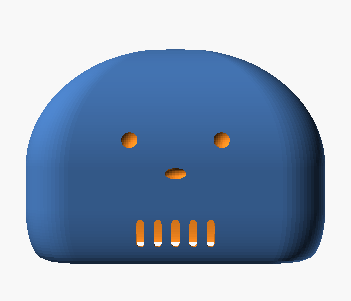
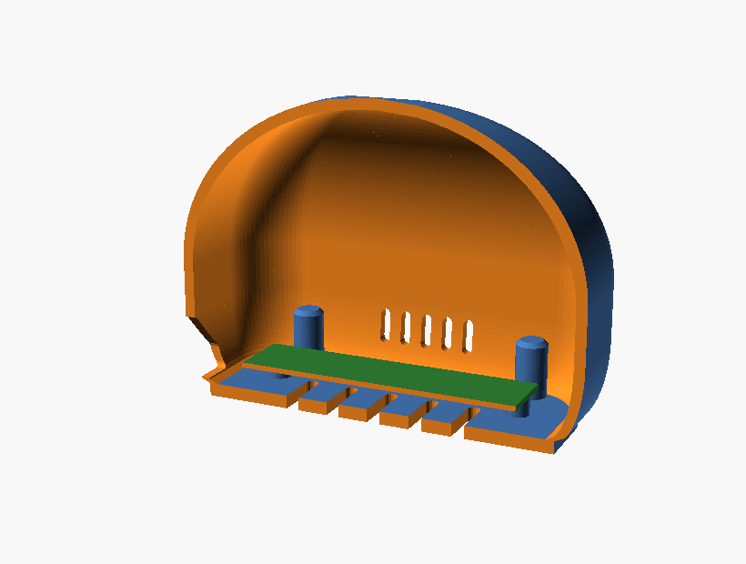
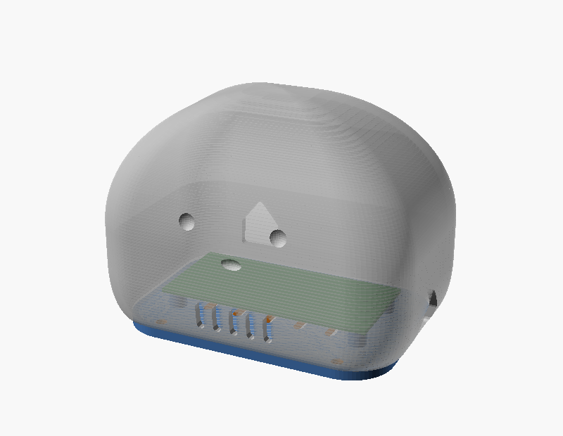
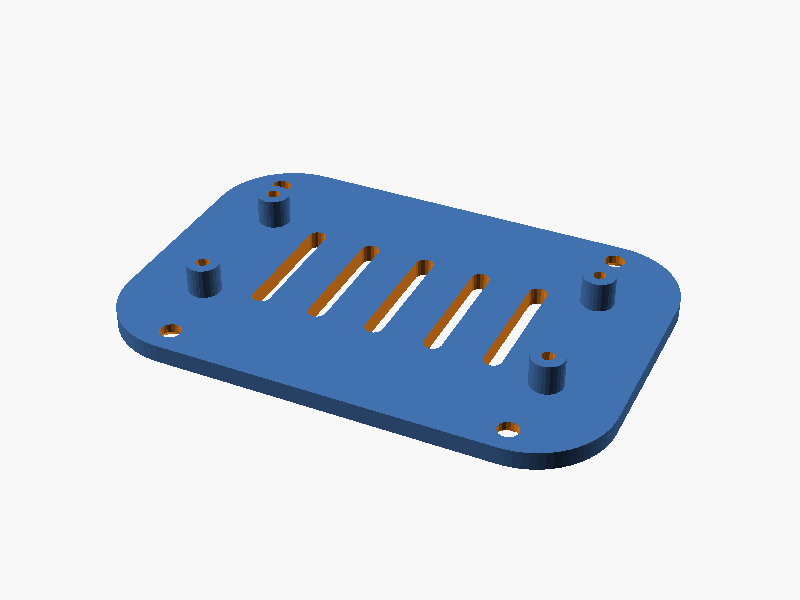

# Modelo para impressão 3D — carcaça do claude-mochi

Carcaça paramétrica do assistente de mesa, feita em OpenSCAD. São **duas peças**,
as duas impressas **sem suporte nenhum**:

| peça    | arquivo                  | o que tem |
|---------|--------------------------|-----------|
| `casca` | `stl/<placa>-casca.stl`  | corpo do mochi, oco, rostinho gravado, grelha frontal, aberturas das portas e os 4 pilares de parafuso |
| `base`  | `stl/<placa>-base.stl`   | tampa do fundo, espaçadores da PCB, rasgos de ventilação, escareados e rebaixos para pés de borracha |

<p align="center">
  
  
</p>
<p align="center">
  
  
</p>

## Medidas

| placa                | corpo (L × P × A) | altura total com a base | material (par completo) |
|----------------------|-------------------|-------------------------|-------------------------|
| `pi_zero` (Pi Zero / Zero 2 W) | 94 × 64 × 68 mm | 71 mm | ≈ 60 g de PLA |
| `pico` (Raspberry Pi Pico)     | 76 × 52 × 56 mm | 59 mm | ≈ 40 g de PLA |

Cabe em qualquer mesa de impressão a partir de 100 × 100 mm.

## Lista de material

- 4 × parafuso **M3 × 12** auto‑atarraxante, cabeça escareada — prende a base na casca
- 4 × parafuso **M2,5 × 6** (Pi Zero) ou **M2 × 6** (Pico) — prende a PCB nos espaçadores
- 4 × pé adesivo de borracha Ø 9 mm (opcional, há rebaixo para eles)

Prefere insertos térmicos M3 nos pilares? Gere a casca com
`-D screw_pilot=4.0` e instale os insertos com o ferro de solda.

## Gerando os arquivos

Os STL já estão em [`stl/`](stl), prontos para fatiar. Para regerar:

```bash
sudo apt install openscad     # ou: brew install --cask openscad
make stl                      # exporta as 4 peças em hardware/stl/
```

Peça por peça, direto no OpenSCAD:

```bash
openscad -o casca.stl -D 'part="casca"' -D 'board_name="pi_zero"' hardware/mochi.scad
openscad -o base.stl  -D 'part="base"'  -D 'board_name="pi_zero"' hardware/mochi.scad
```

Para olhar antes de imprimir, abra `hardware/mochi.scad` no OpenSCAD e use o
Customizer (todos os parâmetros estão agrupados). O parâmetro `part` aceita:

- `"casca"` / `"base"` — cada peça sozinha
- `"chapa"` — as duas lado a lado, já na orientação de impressão
- `"montado"` — conjunto montado, com a placa desenhada por dentro
- `"corte"` — meia‑seção, para conferir folgas e altura das aberturas

## Perfil de fatiamento

| item | valor |
|------|-------|
| orientação | **exatamente como está no STL** — casca com a boca para baixo, base com os espaçadores para cima |
| suportes | **nenhum** (as aberturas têm teto em 45°, os rasgos são autoportantes) |
| altura de camada | 0,2 mm |
| perímetros | 3 |
| preenchimento | 15 % (giroide) |
| topo / fundo | 4 camadas |
| material | PLA; PETG se o mochi for ficar em sol ou perto de fonte de calor |

Dicas que fazem diferença:

- **Topo da cúpula**: é a única região com ângulo raso. Ative *ironing*, ou reduza
  a camada para 0,12 mm nos últimos 8 mm, se quiser acabamento liso.
- **Primeira camada da casca**: o contato com a mesa é só um anel de ~2 mm.
  Use *brim* de 5 mm se sua mesa não for muito aderente.
- **Furos‑guia**: os pilares e espaçadores já vêm com o furo certo para parafuso
  auto‑atarraxante. Não escareie — a rosca se forma no plástico.

## Montagem

1. Limpe as rebarbas das aberturas e dos furos‑guia.
2. Parafuse a PCB nos quatro espaçadores da base (M2,5 × 6 no Pi Zero) — aperte
   só até encostar.
3. Encaixe a casca sobre a base alinhando os cantos; a base entra por baixo com
   0,5 mm de recuo, formando um rasgo de sombra.
4. Prenda com os quatro M3 × 12 por baixo, em cruz.
5. Cole os pés de borracha nos rebaixos.
6. Ligue o cabo por fora, pela abertura traseira. No Pi Zero o cartão microSD
   sai pela abertura da lateral direita, sem precisar abrir a caixa.

## Ajustando o modelo

Principais parâmetros de `mochi.scad`:

| parâmetro | padrão | efeito |
|-----------|--------|--------|
| `board_name` | `"pi_zero"` | `"pi_zero"` ou `"pico"`; define tamanho, furos e portas |
| `board_rot` | padrão da placa | gira a placa dentro da caixa (0/90/180/270) — muda por qual parede o cabo sai |
| `open_ports` | padrão da placa | quais aberturas abrir, por nome |
| `body_w` / `body_d` / `body_h` | 0 (= padrão da placa) | força as medidas externas |
| `s_bottom` | 0,88 | quanto o corpo estreita na base (menor = mais gotinha) |
| `t_fillet` / `t_dome` | 0,24 / 0,42 | onde termina o arredondado de baixo e onde começa a cúpula |
| `corner_f` | 0,24 | raio dos cantos em planta |
| `wall` | 2,4 mm | espessura da parede |
| `face` / `face_depth` | `true` / 1,0 mm | rostinho gravado |
| `vents` / `feet` | `true` | grelha + rasgos de ar / rebaixo dos pés |
| `layers_n` | 72 | fatias usadas para gerar a curva (menos = render mais rápido) |

Exemplo — mochi liso, sem rosto, com as duas portas USB e o microSD abertos:

```bash
openscad -o casca.stl -D 'part="casca"' -D 'face=false' \
  -D 'open_ports=["usb-pwr","usb-data","microsd"]' hardware/mochi.scad
```

Os pilares de parafuso não têm posição fixa: cada um corre pelo arco do seu
canto e para no ponto mais distante da placa **e** de todas as aberturas que
você abriu. Por isso dá para girar a placa ou abrir outra porta sem colisão.

## Colocando outra placa

Edite `boards.scad` e acrescente uma linha em cada função, usando o mesmo nome:
tamanho, furos, furo‑guia, raio do espaçador, portas, portas abertas por padrão,
rotação padrão e tamanho sugerido do corpo. As coordenadas são as do PCB visto
de cima, com origem no canto inferior‑esquerdo.

O modelo se recusa a gerar peça errada: se a placa não couber na abertura do
fundo, se um pilar bater na PCB ou se a parede ficar fina demais para o rosto,
o OpenSCAD para com uma mensagem dizendo qual parâmetro mexer.
